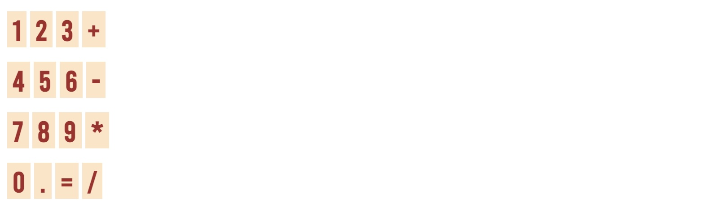

📱 Simple Calculator

This is a basic calculator web app built using HTML, CSS, and JavaScript. It performs simple arithmetic operations like addition, subtraction, multiplication, and division.

🚀 Features
Addition, Subtraction, Multiplication, Division
Simple and clean UI

📸 Preview

